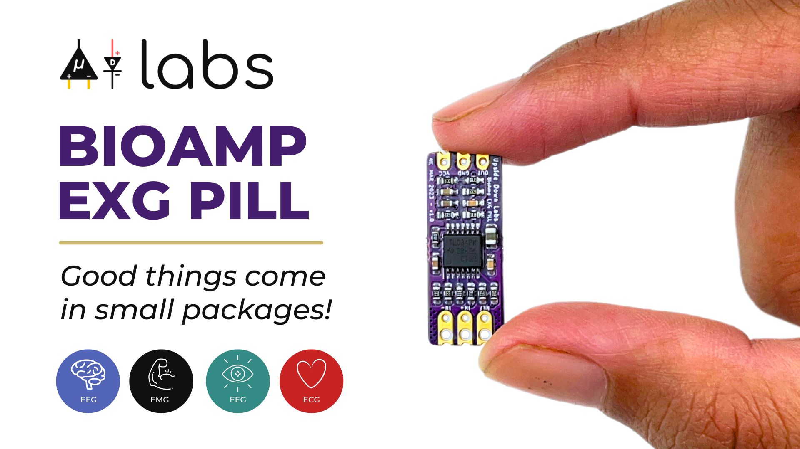
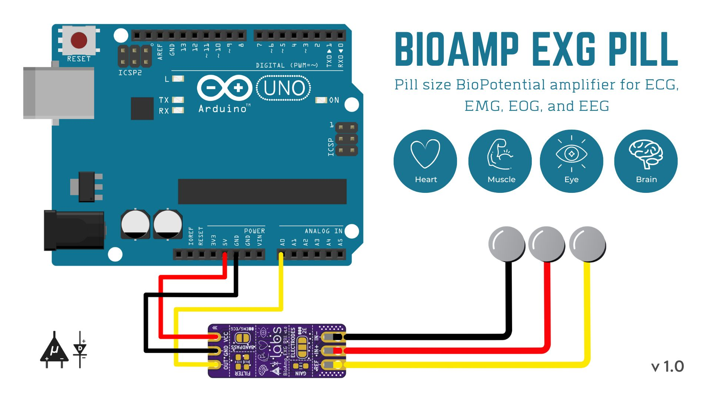
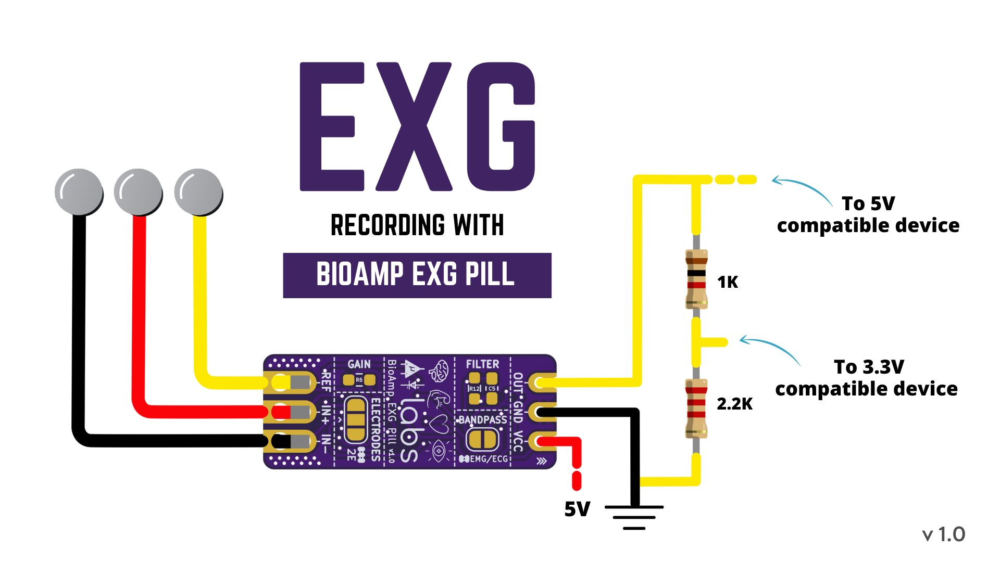

# Device name
It is a long established fact that a reader will be distracted by the readable content of a page when looking at its layout. The point of using Lorem Ipsum is that it has a more-or-less normal distribution of letters, as opposed to using 'Content here, content here', making it look like readable English. Many desktop publishing packages and web page editors now use Lorem Ipsum

## Overview

BioAmp EXG Pill is a small, powerful analog-front-end (AFE) biopotential signal-acquisition board that can be paired with any microcontroller unit (MCU) or single-board computer (SBC) with an analog-to-digital converter (ADC) such as Arduino UNO & Nano, Espressif ESP32, Adafruit QtPy, STM32 Blue Pill, BeagleBone Black, and Raspberry Pi Pico, to name just a few. It also works with any dedicated ADC, like the Texas Instruments ADS1115 and ADS131M0x, among others.

BioAmp EXG Pill is a small, powerful analog-front-end (AFE) biopotential signal-acquisition board that can be paired with any microcontroller unit (MCU) or single-board computer (SBC) with an analog-to-digital converter (ADC) such as Arduino UNO & Nano, Espressif ESP32, Adafruit QtPy, STM32 Blue Pill, BeagleBone Black, and Raspberry Pi Pico, to name just a few. It also works with any dedicated ADC, like the Texas Instruments ADS1115 and ADS131M0x, among others.

## Features And Specifications

| Features & Specifications ||
| :------- | :-------- |
|Minimum Input Voltage|4.5-40 V|
|Input Impedance|10^12 Ω|
|Compatible Hardware|Any development board with an ADC (Arduino UNO & Nano, Espressif ESP32, Adafruit QtPy, STM32 Blue Pill, BeagleBone Black, Raspberry Pi Pico, to name just a few)|
|BioPotentials|EMG, ECG, EOG, EEG (configurable band-pass)|
|No. of channels|1|
|Electrodes|2 or 3 (configurable)|
|Dimensions|25.4 x 10 mm|
|Designed for use with carrier board|Yes|
|Open Source|Hardware + Software|

## Board Layout

Images below shows a quick overview of the BioAmp EXG Pill hardware design.

## ElectroMyoGraphy (EMG)

Electromyography (EMG) is a technique for evaluating and recording the electrical activity produced by skeletal muscles. EMG is also used as a diagnostic procedure to assess the health of muscles and the nerve cells that control them (motor neurons). EMG results can reveal nerve dysfunction, muscle dysfunction, or problems with nerve-to-muscle signal transmission. The images below show an EMG wave recorded with BioAmp EXG Pill and the electrode placement for the recorded EMG respectively.

The BioAmp EXG Pill can be used in a variety of ways, the YouTube video below shows a potential way of using v0.7 of BioAmp EXG Pill.
<iframe width="100%" height="444" src="https://www.youtube.com/embed/-G3z9fvQnuw" title="YouTube video player" frameborder="0" allow="accelerometer; autoplay; clipboard-write; encrypted-media; gyroscope; picture-in-picture; web-share" allowfullscreen></iframe> 

A lot has improved in terms of interference rejection and flexibility from v0.7 to v1.0 of the BioAmp EXG Pill. The YouTube video below shows the ECG, EMG, EOG, and EEG recording using v1.0b of device.
<iframe width="100%" height="444" src="https://www.youtube.com/embed/z9-B9bHWuhg" title="YouTube video player" frameborder="0" allow="accelerometer; autoplay; clipboard-write; encrypted-media; gyroscope; picture-in-picture; web-share" allowfullscreen></iframe>

## Real World Applications
BioAmp EXG Pill is perfect for researchers, makers, and hobbyists looking for novel ways to sample biopotential data. It can be used for a wide variety of interesting biosensing projects, including:

- AI-assisted detection of congestive heart failure using CNN (ECG)
- Heart-rate variability calculation to detect heart ailments (ECG)
- Prosthetic arm (servo) control (EMG)
- Controlling a 3DOF robotic arm (EMG)
- Quantitative analysis of physical therapy for palsy (EMG)
- Real-time game controllers (EOG)
- Blink detection (EOG)
- Capturing photos with a blink of an eye (EOG)
- Controlling LEDs via brain waves (EEG)
- Patient monitoring
and many more examples. 

